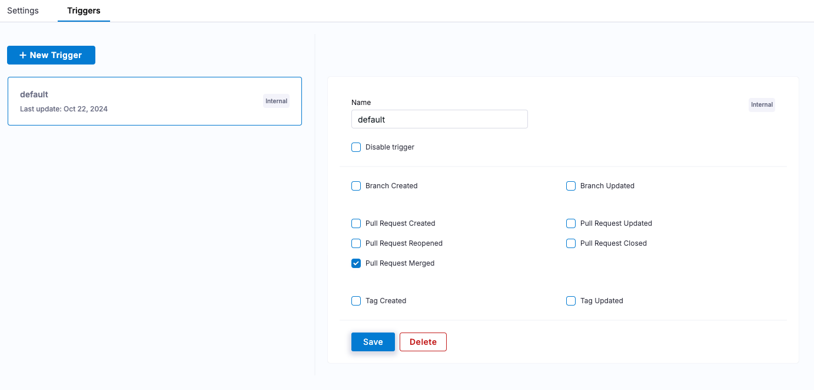

# harness-lab

This lab will guide you through setting up and using Harness Open Source (referred to as "Harness" from now on), with a focus on managing a project, using GitSpaces, creating pipelines, and setting up an artifact registry. By the end of the lab, you'll be able to create a project, import a repository, work with GitSpaces, and automate build pipelines.

## Prerequisites

Before starting, ensure you have the following installed on your local machine:

- Docker runtime and client (Docker Desktop, Rancher Desktop, or Colima)
- VS Code (optional but recommended for working with GitSpaces)
- [k3d](https://k3d.io/) for a local Kubernetes cluster
- [kubectl](https://formulae.brew.sh/formula/kubernetes-cli) for interacting with the Kubernetes cluster

Configure insecure registries based on your docker daemon:

```json
"insecure-registries": [
    "localhost:3000",
    "0.0.0.0:3000",
    "127.0.0.1:3000",
    "host.docker.internal:3000"
  ]
```

## Harness Installation

1. Run the following command to start a Harness instance:

```bash
docker run -d \
  -p 3000:3000 -p 3022:3022 \
  -v /var/run/docker.sock:/var/run/docker.sock \
  -v /tmp/harness:/data \
  --name harness \
  --restart always \
  harness/harness
```

This command starts the Harness server, exposes it on port 3000, and mounts necessary volumes for Docker and persistent data storage.

2. Follow these steps to create an admin user:

   - Once the container is running, open http://localhost:3000 in your browser.
   - Select **Sign Up**.
   - Enter a User ID (`admin`), Email (`admin@example.com`), and Password (`changeit`).
   - Select **Sign Up**. (You might see a warning to change your password. You can ignore that warning.)

## Kubernetes Cluster Setup

1. Create a directory for the kubeconfig file:

```bash
mkdir -p /tmp/k3d
```

2. Create and open the kubeconfig file:

```bash
vim /tmp/k3d/config.yaml
```

3. Copy the following content to the above file:

```YAML
apiVersion: k3d.io/v1alpha4 # this will change in the future as we make everything more stable
kind: Simple # internally, we also have a Cluster config, which is not yet available externally
metadata:
  name: podinfo # name that you want to give to your cluster (will still be prefixed with `k3d-`)
servers: 1 # same as `--servers 1`
ports:
  - port: 30005-30010:30005-30010 # same as `--port '8080:80@loadbalancer'`
    nodeFilters:
      - loadbalancer
registries: # define how registries should be created or used
  config: | # define contents of the `registries.yaml` file (or reference a file); same as `--registry-config /path/to/config.yaml`
    mirrors:
      "host.docker.internal:3000":
        endpoint:
          - http://host.docker.internal:3000
options:
  k3s: # options passed on to K3s itself
    extraArgs: # additional arguments passed to the `k3s server|agent` command; same as `--k3s-arg`
      - arg: --tls-san=host.docker.internal
        nodeFilters:
          - server:*
```

4. Create a k3d cluster:

```bash
k3d cluster create -c /tmp/k3d/config.yaml
```

5. Copy the kubeconfig to the clipboard and save it temporarily:

For macOS:

```bash
k3d kubeconfig get podinfo | sed 's/0.0.0.0/host.docker.internal/g' | pbcopy
```

For Linux:

```bash
k3d kubeconfig get podinfo | sed 's/0.0.0.0/host.docker.internal/g' | xclip -selection clipboard
```

OR

```bash
k3d kubeconfig get podinfo | sed 's/0.0.0.0/host.docker.internal/g' | xsel --clipboard
```

## Project and Repository

### New Project

1. Select **New Project**.
2. Enter a project Name (**harness-lab**) and optional Description (**Open source code hosting, pipelines, artifact registry, dev environments**).
3. Select **Create Project**.
   > [!NOTE]
   > Harness can also [import projects](https://docs.gitness.com/administration/project-management#import-a-project) from external sources (such as GitLab groups or GitHub organizations).
4. You can organize your work in Harness by creating labels to categorize pull requests, artifacts, and more. To get started, add three labels to your project: "dev," "staging," and "prod." You can also assign specific values to each of these labels, helping to streamline project management and tracking.

### Import a Repository

1. Click on the drop-down under **Repositories**, and select "Import Repository".
2. The **Git Provider** is "GitHub".
3. Use `harness-community` for the organization and `podinfo` for the repository.
4. Click **Import Repository**.

### Webhook

You can send data to HTTP endpoints from actions in your repository, such as opened pull requests, new branches, and more. For this exercise, you’ll use [webhook.site](https://webhook.site) - a website that offers unique, random URLs to instantly receive and inspect all incoming HTTP requests and webhooks in real-time, facilitating testing and debugging. For free webhook.site users, the URL and its data are kept for 7 days. You can close the browser tab and still return to the same unique webhook.site URL.

1. Navigate to webhook.site and copy your unique URL.
2. Click on **Webhooks** under the podinfo repository and then **+ New Webhook**.
3. Give this webhook a name: `trigger_on_branch_created`.
4. Paste the unique URL you copied under Payload URL. You can leave out the Secret.
5. Choose **Let me select individual events** and select **Branch created**.
6. Click **Create Webhook**.

You'll need to reuse this webhook URL in a later section. Go to **Secrets --> + New Secret** and add a new secret called **webhook_url**. Use the value of the unique URL you have copied.

Now, continue to the next section to push a new branch. Once a new branch is pushed, you’ll see the trigger in action on this site.

### Create a Branch to Trigger Webhook

1. Within the podinfo repository, create a new branch named "feature".
2. On webhook.site, you should see a notification indicating that the webhook was triggered.

The response will look something like this:

```json
{
  "trigger": "branch_created",
  "repo": {
    "id": 1,
    "path": "harness-lab/podinfo",
    "identifier": "podinfo",
    "description": "",
    "default_branch": "master",
    "url": "http://159.203.33.47:3000/harness-lab/podinfo",
    "git_url": "http://159.203.33.47:3000/git/harness-lab/podinfo.git",
    "git_ssh_url": "ssh://git@159.203.33.47:3022/harness-lab/podinfo.git",
    "uid": "podinfo"
  },
  "principal": {
    "id": 4,
    "uid": "admin",
    "display_name": "Administrator",
    "email": "mail@example.com",
    "type": "user",
    "created": 1724895740977,
    "updated": 1724895740977
  },
  "ref": {
    "name": "refs/heads/feature3",
    "repo": {
      "id": 1,
      "path": "harness-lab/podinfo",
      "identifier": "podinfo",
      "description": "",
      "default_branch": "master",
      "url": "http://159.203.33.47:3000/harness-lab/podinfo",
      "git_url": "http://159.203.33.47:3000/git/harness-lab/podinfo.git",
      "git_ssh_url": "ssh://git@159.203.33.47:3022/harness-lab/podinfo.git",
      "uid": "podinfo"
    }
  },
  "sha": "dbf831f84f486243998a2f86cda9fa76d9f1b748",
  "head_commit": {
    "sha": "dbf831f84f486243998a2f86cda9fa76d9f1b748",
    "message": "Updated pipeline testpipe",
    "author": {
      "identity": { "name": "Administrator", "email": "mail@example.com" },
      "when": "2024-09-03T17:38:34Z"
    },
    "committer": {
      "identity": { "name": "Gitness", "email": "system@gitness.io" },
      "when": "2024-09-03T17:38:34Z"
    },
    "added": [],
    "removed": [],
    "modified": []
  },
  "commit": {
    "sha": "dbf831f84f486243998a2f86cda9fa76d9f1b748",
    "message": "Updated pipeline testpipe",
    "author": {
      "identity": { "name": "Administrator", "email": "mail@example.com" },
      "when": "2024-09-03T17:38:34Z"
    },
    "committer": {
      "identity": { "name": "Gitness", "email": "system@gitness.io" },
      "when": "2024-09-03T17:38:34Z"
    },
    "added": [],
    "removed": [],
    "modified": []
  },
  "old_sha": "0000000000000000000000000000000000000000",
  "forced": false
}
```

### Secret Detection

From **Repositories --> podinfo --> Manage Repository --> Security**, enable **Secret Scanning**. Harness Open Source includes [gitleaks](https://github.com/gitleaks/gitleaks) integrations for detecting and preventing hardcoded secrets.

Now, from **Repositories --> podinfo** click **Clone** and copy the HTTPS git clone URL. Clone and open this repository on your code editor. Right below the **Git clone URL**, click the button to generate clone credential.

On your code editor, create a new file called **config.yaml** under the podinfo repository and add the following:

```bash
SECRET=pat.W3bJ9X4K2L8V7fH1pG0M5nQ.ZM1cP9gB5L2vJ8K6R3wY1N4z.X9V7cT3pB5M1nF2G4J0K
```

The above follows the same pattern as a Harness Personal Access Token. While this is not a valid token, it has the same pattern as a Harness Personal Access Token.

Configure git credentials before you commit:

```bash
git config -–global user.email “admin@example.com”
git config -–global user.name “admin”
```

Now save the `config.yaml` file and try to commit and push the changes. Use the Git credentials you copied earlier. The built-in scanner in Harness will detect the pattern and prevent you from pushing the commit.

This approach is much safer than detecting secrets after they've been committed.

## GitSpaces

### Create a GitSpace for VS Code Desktop

1. Create a GitSpace for the `podinfo/master` branch and open it in VS Code Desktop.
2. You will need to create a token and add it to the Gitness extension on VSCode. To do so, click **Admin** and then **+ New Token**.
3. Build the binary for podinfo by running:

   ```bash
   go build ./cmd/podinfo
   ```

You should see the following error:

```
bash: go: command not found
```

GitSpaces come with an Ubuntu image (`mcr.microsoft.com/devcontainers/base:dev-ubuntu-24.04`) if you don’t have a DevContainer file with a base image defined.

In your gitspace, add the following file to your repo: `podinfo/files/master/~/.devcontainer/devcontainer.json`

```
{
    "image": "mcr.microsoft.com/devcontainers/go"
}
```

Merge the changes.

Stop and delete the GitSpace instance, then recreate it. Retry the above command, and this time, the Go build should succeed.

3. Run the app:

   ```bash
   ./podinfo
   ```

4. Open another terminal within VS code and `curl localhost:9898` to see the app running version `6.6.1`:

```json
{
  "hostname": "032d90c07ce6",
  "version": "6.6.1",
  "revision": "unknown",
  "color": "#34577c",
  "logo": "https://raw.githubusercontent.com/stefanprodan/podinfo/gh-pages/cuddle_clap.gif",
  "message": "greetings from podinfo v6.6.1",
  "goos": "linux",
  "goarch": "arm64",
  "runtime": "go1.23.1",
  "num_goroutine": "6",
  "num_cpu": "2"
}
```

### Create gitspaces for VS Code Browser

Make sure to merge your master branch into your feature branch before continuing.

1. Create a gitspaces for the `podinfo/feature` branch and open it in VS Code Browser.
2. Make a change to `pkg/version/version.go` and update the version to **6.6.2**. Save the file.
3. Build the binary for podinfo by running:

   ```bash
   go build ./cmd/podinfo
   ```

4. Run the app:

   ```bash
   ./podinfo
   ```

5. Open your browser and navigate to [http://localhost:9898](http://localhost:9898) to see the app running version `6.6.2`.

6. Commit and push the change to feature branch.

> [!NOTE]
> Observe that these gitspaces instances are already configured with git credentials from Harness Open Source so you don't have to configure git credentials.

## Pipeline

### Create a New Pipeline

1. In the podinfo repository, go to **Pipelines** and click **+ New Pipeline**.
2. Click "Generate" to let Harness automatically create a pipeline for your Go project. This pipeline should install dependencies, build the app, and run tests.
3. Click "Save and Run" to execute the pipeline and ensure all steps complete successfully.

## Artifact Registry

### Create an Artifact Registry

1. Navigate to **Artifact Registries --> + New Artifact Registry** and create a new docker artifact registry named "harness-reg".
2. In the registry settings, click **Set up client** to retrieve the connection credentials to that registry. Make a note of the username.
3. Click **Generate token** and make a note of the token.

### Add Secrets

1. Navigate to Secrets in the Harness dashboard.
2. Add three secrets:
   - `docker_username`: Use the registry username from the previous step. For most cases, this would be **admin**.
   - `docker_password`: Use the generated token from the previous step.
   - `kubeconfig`: Use the kubeconfig copied from a previous section.

### Create a Pipeline for Build, Test, and Push

Create a new pipeline called "build-test-push" and use the following YAML configuration:

```yaml
kind: pipeline
spec:
  stages:
    - name: build-test-push-scan
      spec:
        platform:
          arch: amd64
          os: linux
        steps:
          - name: go_install
            spec:
              container:
                image: golang:1.23
            script:
              - go install ./...
            type: run
          - name: go_test
            spec:
              container:
                image: golang:1.23
            script:
              - go test -v ./...
            type: run
          - name: go_build_push
            type: plugin
            spec:
              name: docker
              inputs:
                insecure: true
                repo: host.docker.internal:3000/harness-lab/harness-reg/podinfo
                registry: host.docker.internal:3000
                username: ${{ secrets.get("docker_username") }}
                password: ${{ secrets.get("docker_password") }}
                tags: ${{ build.number }}
      type: ci
version: 1
```

Click **Save and Run** to execute the pipeline.

#### Troubleshooting

- For local installations, add `host.docker.internal:3000` as an insecure-registry in your docker config.
- For cloud VM installations, add `YOUR_IP:3000` as an insecure-registry in your docker config.

1. Locate your Docker configuration file:

- On Linux or macOS, this is typically located at `/etc/docker/daemon.json`.
- On Windows, you might find it at `C:\ProgramData\docker\config\daemon.json`.

2. Edit the `daemon.json` file. If the file does not exist, create it.
3. Add the following content, making sure to replace `IP:PORT` with the actual address of your insecure registry:

```json
{
  "insecure-registries": ["IP:PORT"]
}
```

4. Restart Docker: After saving your changes, restart the Docker service for the new configuration to take effect.

`sudo systemctl restart docker` or `colima restart`.

### Verify

Check the artifact registry to ensure the new image has been successfully pushed.

## Add Security Testing

In this step, we use a popular open source image scanning tool called [Grype](https://github.com/anchore/grype). The goal is to integrate Grype into the pipeline to scan the newly built image for vulnerabilities before promoting it to the prod environment.

### Updated Pipeline

Modify the [pipeline](build-test-push-scan.yaml) to include a new step for Grype scanning:

```YAML
version: 1
kind: pipeline
spec:
  stages:
    - name: build-test-push-scan
      spec:
        platform:
          arch: amd64
          os: linux
        steps:
          - name: go_install
            spec:
              container:
                image: golang:1.23
              script:
                - go install ./...
            type: run
          - name: go_test
            spec:
              container:
                image: golang:1.23
              script:
                - go test -v ./...
            type: run
          - name: go_build_push
            type: plugin
            spec:
              name: docker
              inputs:
                insecure: true
                repo: host.docker.internal:3000/harnes-lab/harness-reg/podinfo
                registry: host.docker.internal:3000
                username: ${{ secrets.get("docker_username") }}
                password: ${{ secrets.get("docker_password") }}
                tags: ${{ build.number }}
          - name: Grype_Image_Scan
            type: run
            spec:
              container: alpine
              envs:
                GRYPE_REGISTRY_INSECURE: "true"
                GRYPE_REGISTRY_INSECURE_USE_HTTP: "true"
                GRYPE_REGISTRY_INSECURE_SKIP_TLS_VERIFY: "true"
                GRYPE_REGISTRY_AUTH_USERNAME: ${{ secrets.get("docker_username") }}
                GRYPE_REGISTRY_AUTH_PASSWORD: ${{ secrets.get("docker_password") }}
              script: |
                apk add --no-cache curl
                curl -sSfL https://raw.githubusercontent.com/anchore/grype/main/install.sh | sh -s -- -b /tmp/grype-bin
                /tmp/grype-bin/grype host.docker.internal:3000/harnes-lab/harness-reg/podinfo:${{ build.number }}
                echo "Image scan completed!"
      type: ci
  version: 1
```

### Update default trigger

Each pipeline comes with a default trigger. From the pipeline settings, update the default trigger to activate the pipeline only on **Pull Request Merged** events.



### Merge a Pull Request to trigger the pipeline

From the "feature" branch, create a new Pull Request (PR) to the "master" branch and merge the PR. This will trigger the pipeline and the **Grype_Image_Scan** step will scan the newly built image for vulnerabilities.

## Deploy to Kubernetes

Update the [pipeline](build-test-push-scan-deploy.yaml) as follows:

```YAML
kind: pipeline
spec:
  stages:
    - name: e2e
      spec:
        platform:
          arch: amd64
          os: linux
        steps:
          - name: setup
            spec:
              container:
                image: golang:1.23
              script:
                - go install ./...
            type: run
          - name: test
            spec:
              container:
                image: golang:1.23
              script:
                - go test -v ./...
            type: run
          - name: build
            type: plugin
            spec:
              name: docker
              inputs:
                insecure: true
                repo: host.docker.internal:3000/harnes-lab/harness-reg/podinfo
                registry: host.docker.internal:3000
                username: ${{ secrets.get("docker_username") }}
                password: ${{ secrets.get("docker_password") }}
                tags: ${{ build.number }}
          - name: scan
            type: run
            spec:
              container: alpine
              envs:
                GRYPE_REGISTRY_INSECURE: "true"
                GRYPE_REGISTRY_INSECURE_USE_HTTP: "true"
                GRYPE_REGISTRY_INSECURE_SKIP_TLS_VERIFY: "true"
                GRYPE_REGISTRY_AUTH_USERNAME: ${{ secrets.get("docker_username") }}
                GRYPE_REGISTRY_AUTH_PASSWORD: ${{ secrets.get("docker_password") }}
              script: |
                apk add --no-cache curl
                curl -sSfL https://raw.githubusercontent.com/anchore/grype/main/install.sh | sh -s -- -b /tmp/grype-bin
                /tmp/grype-bin/grype host.docker.internal:3000/harnes-lab/harness-reg/podinfo:${{ build.number }}
                echo "Image scan completed!"
          - name: deploy
            type: run
            spec:
              container: bitnami/kubectl
              envs:
                KUBECONFIG_CONTENT: ${{ secrets.get("kubeconfig") }}
                KUBECONFIG: /tmp/kubeconfig.yaml
                FRONTEND_IMAGE: host.docker.internal:3000/harnes-lab/harness-reg/podinfo:${{ build.number }}
                BACKEND_IMAGE: host.docker.internal:3000/harnes-lab/harness-reg/podinfo:${{ build.number }}
                DOCKER_CONFIG_JSON: ${{ secrets.get("docker-config-json") }}
                DOCKER_USERNAME: ${{ secrets.get("docker_username") }}
                DOCKER_PASSWORD: ${{ secrets.get("docker_password") }}
              script: |
                kubectl version --client
                envsubst --version

                # set correct kubeconfig
                echo "$KUBECONFIG_CONTENT" > $KUBECONFIG

                # apply kubeconfig
                cd deploy

                # apply common manifests
                kubectl apply -f ./webapp/common

                # create a docker registry secrete yaml
                kubectl create secret docker-registry harness-registry-secret \
                  --docker-server=host.docker.internal:3000 \
                  --docker-username=$DOCKER_USERNAME \
                  --docker-password=$DOCKER_PASSWORD \
                  -n webapp \
                  --dry-run=client \
                  -o yaml | kubectl apply -f -

                # apply backend manifest
                kubectl apply -f ./webapp/backend
                envsubst < ./webapp/backend/deployment.yaml | kubectl apply -f -

                # apply frontend manifest
                kubectl apply -f ./webapp/frontend
                envsubst < ./webapp/frontend/deployment.yaml | kubectl apply -f -

                #  check the rollout status
                kubectl rollout status --namespace webapp deployment/frontend --timeout=1m

                # verify running pods and services
                kubectl get pods --namespace webapp
                kubectl get services --namespace webapp

                echo "success"
              shell: bash
      type: ci
version: 1
```

After the pipeline succeeds, visit `http://localhost:30006` to use the deployed frontend service.

### Notifications

Update the pipeline to add a notifications step on pipeline failure.

```
kind: pipeline
spec:
  stages:
    - name: e2e
      spec:
        platform:
          arch: amd64
          os: linux
        steps:
          - name: setup
            spec:
              container:
                image: golang:1.23
              script:
                - go install ./...
            type: run
          - name: test
            spec:
              container:
                image: golang:1.23
              script:
                - go test -v ./...
            type: run
          - name: build
            type: plugin
            spec:
              name: docker
              inputs:
                insecure: true
                repo: host.docker.internal:3000/harnes-lab/harness-reg/podinfo
                registry: host.docker.internal:3000
                username: ${{ secrets.get("docker_username") }}
                password: ${{ secrets.get("docker_password") }}
                tags: ${{ build.number }}
          - name: scan
            type: run
            spec:
              container: alpine
              envs:
                GRYPE_REGISTRY_INSECURE: "true"
                GRYPE_REGISTRY_INSECURE_USE_HTTP: "true"
                GRYPE_REGISTRY_INSECURE_SKIP_TLS_VERIFY: "true"
                GRYPE_REGISTRY_AUTH_USERNAME: ${{ secrets.get("docker_username") }}
                GRYPE_REGISTRY_AUTH_PASSWORD: ${{ secrets.get("docker_password") }}
              script: |
                apk add --no-cache curl
                curl -sSfL https://raw.githubusercontent.com/anchore/grype/main/install.sh | sh -s -- -b /tmp/grype-bin
                /tmp/grype-bin/grype host.docker.internal:3000/harnes-lab/harness-reg/podinfo:${{ build.number }}
                echo "Image scan completed!"
          - name: deploy
            type: run
            spec:
              container: bitnami/kubectl
              envs:
                KUBECONFIG_CONTENT: ${{ secrets.get("kubeconfig") }}
                KUBECONFIG: /tmp/kubeconfig.yaml
                FRONTEND_IMAGE: host.docker.internal:3000/harnes-lab/harness-reg/podinfo:${{ build.number }}
                BACKEND_IMAGE: host.docker.internal:3000/harnes-lab/harness-reg/podinfo:${{ build.number }}
                DOCKER_CONFIG_JSON: ${{ secrets.get("docker-config-json") }}
                DOCKER_USERNAME: ${{ secrets.get("docker_username") }}
                DOCKER_PASSWORD: ${{ secrets.get("docker_password") }}
              script: |
                kubectl version --client
                envsubst --version

                # set correct kubeconfig
                echo "$KUBECONFIG_CONTENT" > $KUBECONFIG

                # apply kubeconfig
                cd deploy

                # apply common manifests
                kubectl apply -f ./webapp/common

                # create a docker registry secrete yaml
                kubectl create secret docker-registry harness-registry-secret \
                  --docker-server=host.docker.internal:3000 \
                  --docker-username=$DOCKER_USERNAME \
                  --docker-password=$DOCKER_PASSWORD \
                  -n webapp \
                  --dry-run=client \
                  -o yaml | kubectl apply -f -

                # apply backend manifest
                kubectl apply -f ./webapp/backend
                envsubst < ./webapp/backend/deployment.yaml | kubectl apply -f -

                # apply frontend manifest
                kubectl apply -f ./webapp/frontend
                envsubst < ./webapp/frontend/deployment.yaml | kubectl apply -f -

                #  check the rollout status
                kubectl rollout status --namespace webapp deployment/frontend --timeout=1m

                # verify running pods and services
                kubectl get pods --namespace webapp
                kubectl get services --namespace webapp

                echo "success"
              shell: bash
          - name: notify
            type: plugin
            when: failure()
            spec:
              name: webhook
              inputs:
                content_type: application/json
                urls: ${{ secrets.get("webhook_url") }}
                template: |
                  Name: Harness Build Notification
                  Repo Name: {{ repo.name }}
                  Build Number {{ build.number }}
                  Build Event: {{ build.event }}
                  Build Status: {{ build.status }}
      type: ci
version: 1
```

Introduce a failure in the pipeline for the notification step to be triggered and you'll see a notification like this on `webhook.site`:

```
Name: Harness Build Notification
Repo Name: podinfo
Build Number 9
Build Event: pull_request
Build Status: failure
```

## API

Check out the [Swagger API](http://localhost:3000/swagger) to programmatically create and manage Harness resources. You'll need to [generate a token](https://developer.harness.io/docs/open-source/administration/user-management#generate-user-token) to get started.

## Next Steps

This was just a teaser of what you can do with Harness Open Source. Check out the [docs](https://developer.harness.io/docs/open-source/overview) to build something awesome with Harness.
